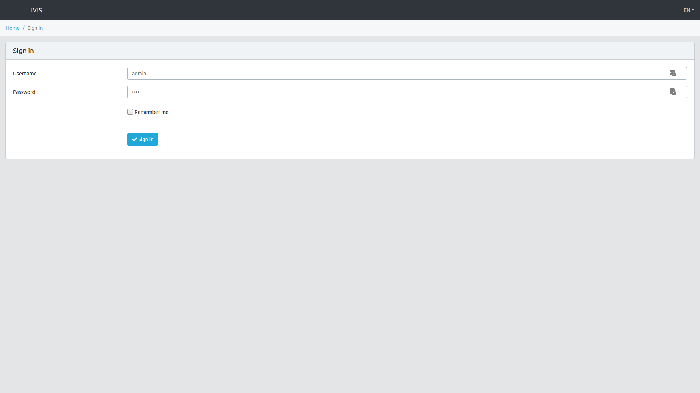
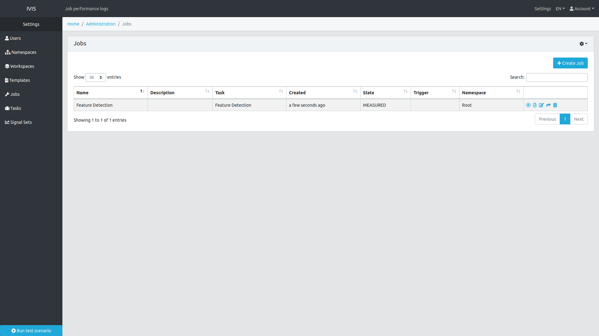
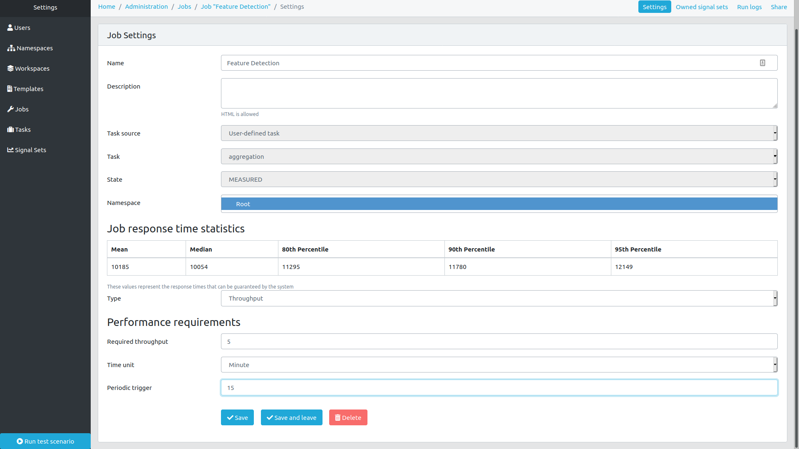
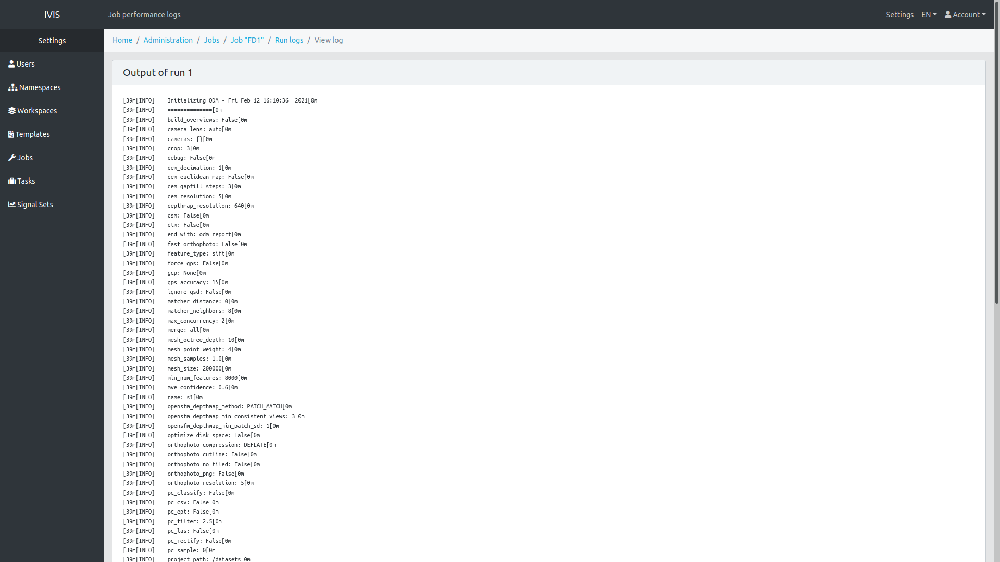
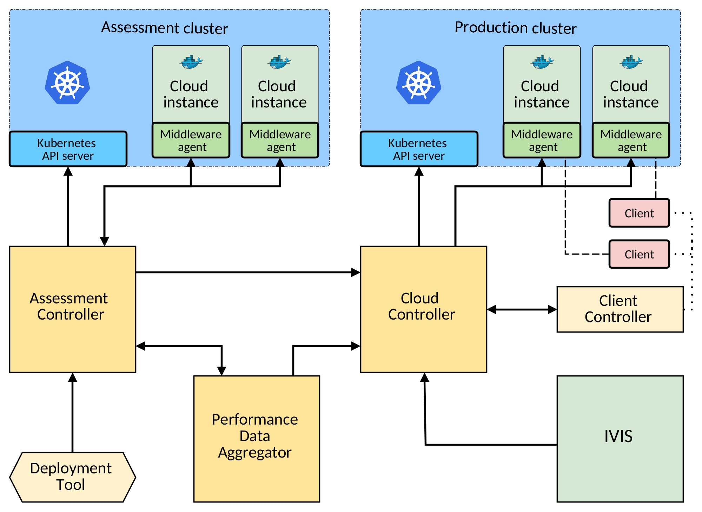

# Self-adaptive K8S Cloud Controller for Time-sensitive Applications

If you want to try out the framework, follow the Installation and Usage sections. The rest of this document describes the architecture of the framework, how to use the framework for your own use cases, and how to configure and modify the framework.

### Table of Contents

1. [Installation](#installation)
2. [Usage](#usage)
3. [Using the framework for your own use case](#using-the-framework-for-your-own-use-case)
4. [Framework architecture](#framework-architecture)
5. [Configuration](#configuration)


## Installation

The framework can be installed with the Vagrantfile located in the `setup` folder. The setup consists of 3 virtual machines. Two of them are running Kubernetes nodes, and the third runs the cloud controller and the IVIS platform. The functionality of the cloud controller can be accessed through the IVIS web interface.

### Hardware requirements

The VMs in this setup take 11 GB of RAM and 6 CPUs combined.

### Prerequisites

In order to set up the VMs, you need to have Vagrant and Ansible installed.

On Fedora, they can be installed with the following command:

```
dnf install vagrant ansible
```

On Ubuntu the same can be achieved with the following:

```
apt-get update && apt-get install software-properties-common && apt-add-repository ppa:ansible/ansible && apt-get update
apt-get install vagrant ansible
```

### Setting up the VMs

The VMs can be created with the following commands (executed from the folder where Vagrantfile is located)

```
vagrant box add d3s/controller
vagrant box add d3s/k8s-node
vagrant up
```

After `vagrant up` finishes execution, you will be able to access the IVIS interface through your browser

In order to destroy the VMs, run `vagrant destroy -f` from the same directory.

## Usage

1. You can access the IVIS web interface through your browser at 10.0.3.3:8080.

2. The username to log in with is "admin", and the password is "test".

   

3. Once you have logged in, go to Settings, and press "Run test scenario" button. 
   This will create several initial IVIS entities to work with.

4. Go to the "Jobs" panel. In the list of jobs you should see the Feature Detection job. 
   If it is in the MEASURING state, wait a couple of seconds and refresh the page, the job will get to the MEASURED state.
   Once the job is in the MEASURED state, press the Edit icon next to the job entry.
   
   

5. At the bottom of job edit page, you can specify the QoS requirements for the job. 
   The table on that page shows the best possible values of response time that can be guaranteed at different percentiles.
   You can specify whether you want to set a response time requirement or a throughput requirement in a dropdown list.
   For response time requirements, you have to specify the percentile (1 to 99), and a time limit in seconds 
   (note, that the response time values in the table are milliseconds).
   The throughput requirements are expressed as the number of runs that have to be executed in some time period 
   (e.g. 4 runs per minute).    
   Additionally, you can set a time trigger for the job. 
   In this case, the job will be executed periodically with the specified interval.
   After you finish QoS requirement specification, press "Save and Exit".
   
   

6. Depending on the viability of the specified QoS requirement, the job will get into either ACCEPTED or REJECTED state.
   If the job was accepted, it will get into the DEPLOYED state after some time. 
   For the first instance of the job, the deployment may last several minutes, depending on your internet connection
   (this is due to the fact that a Docker image for the job needs to be downloaded).
   Additional instances that use the same Docker image are usually deployed within 10 seconds. 

7. After the job gets into the DEPLOYED state, you can execute a run of the job by clicking the "Run" button next to the job entry.
   This way the job can be executed manually, if a periodic trigger was not specified.

8. You can access the run logs of the deployed job by clicking the "Logs" button. Each entry in the table corresponds to an individual run.

   

9. Clicking "View Run output" next to an entry corresponding to a completed run will show you the logs of that run. 
   If the run status is "Success" it will show the standard output of that run. If the status is "Failed", it will show the standard error output.
   
   

10. You can add more instances of the same job by clicking "Run test scenario" button again.
    After that, you can specify the QoS requirements for that job in the same way.
    Alternatively, you can clone an already deployed job by clicking "Add job" button.
      It will open a new job settings page.
      There, you have to specify the name for the job, and check the "Run in Kubernetes cloud" and 
      "Use an already existing job as a template" boxes.
      Then, choose a template job from the dropdown list (only the jobs in ACCEPTED and DEPLOYED states are displayed in the list).
      Finally, press "Save and Exit".
      The new job will copy all the properties of the template job, including the QoS requirement and time trigger. 
    

   

11. Since the cluster is very small, the number of instances that can run at the same time is very low due to memory limitations.
    Normally, you will be able to add 1 to 4 instances, depending on the strictness of the QoS requirement that you set.
    Additional instances will not be deployed (in the jobs table they will be displayed with NO_RESOURCES state). 

12. Visualizations of job performance can be accessed in "Workspaces/Job performance logs". 
      There, you can choose a panel from the list in order to see a visualization for the corresponding job.
      Note that a visualization will not be displayed if there are no completed runs of the job (since there are no data to visualize).

   


## Using the framework for your own use case

This section describes how to run the framework on your own machine, deploy applications into it, and how to integrate the middleware library into your own Docker images used with the framework.

### Running the framework

The steps have to be done before the first run of the framework.

1. Make sure two Kubernetes clusters (production and assessment) are set up and running.
2. Run `pip3 install -r requirements.txt` to install the required libraries.
3. Run `python3 ./generate_grpc.py` to generate protocol buffers and gRPC stubs.

The framework consists of several processes. They can be started in the following way (the commands  are executed from the root folder of the project):

1. Start the assessment controller process:  `./run_assessment.sh`.
2. Start the cloud controller process:  `./run_production.sh`.
3. Start the performance data aggregator process:  `./run_aggregator.sh`.
4. Start the client controller process: `./run_cc.sh`. 
   This is only necessary if you want to submit applications containing external clients.

### Deploying applications

In addition to deploying applications with the IVIS web interface (as shown in the section Usage), applications can be deployed with the command-line deployment tool.

In this case, the application has to be specified with an application descriptor (a YAML file that describes the application). Examples of application descriptors can be found in the demonstrators located in the `examples` folder.

Below is the list of commands supported by the deployment tool.

```bash
# Submiting an application descriptor:

./depltool.sh submit application.yaml

# Getting the measurement and deployment status of a submitted application:

./depltool.sh status application

# Getting the values of response time and throughput of a measured application:

./depltool.sh get-time 99 application component probe

./depltool.sh get-throughput application component probe

# Submitting QoS requirements for an application:

./depltool.sh submit-requirements requirements.yaml

# Deleting a submitted application:

./depltool.sh delete application
```

### Integrating middleware agent

All the modules of the control middleware library are located in the `cloud_controller.middleware` package. There are three essential classes in the package. `MiddlewareAgent` is the class that exposes the gRPC interface through which the framework controls the cloud instances. `ComponentAgent` and `ClientAgent` are the classes through which the application-side code can interact with the framework and its services.

There are two ways to integrate the middleware agent into a component. The first way is to run the midleware agent as the main program of the container. This can be done, e.g. by setting the entry point of the container to the `run_middleware_agent.py` module. In this case, management and ititialization of instances is fully handled by the framework. Development of a component for the framework in this case consists of two steps: (i) building a Docker image for the component, and (ii) writing the code of the probes and providing it along with the application descriptor.

The framework includes a default Docker image that integrates the middleware agent in the way described above. With this image the first of two steps can be skipped.

The second way to integrate the middleware agent is by instantiating and starting the component agent object in the application-side code. Calling the `start` method on that object starts a non-daemon thread that runs the middleware agent. With this option, the probes can be registered as callable procedures.

Using the component agent requires some degree of cooperation on the side of application developer with respect to controlling the lifecycle of an instance. Instance initialization in this case consists of two parts: framework-side and application-side. The application-side code needs to notify the agent when its initialization is completed through the `set_ready` method. The agent will signal the completion of framework-side initialization by invoking the callback function provided to it at initialization. An instance can be provided to other instances as a dependency only if both parts of initialization are completed.

Instance finalization is also divided in two parts in the same way. The framework will not remove an instance from the cloud until it is finalized by the application-side code.

### Integrating client agent

An external client must run a client agent in order to be able to connect to the framework. At initialization, a client agent needs to receive a name of an application and a name of a client type. It communicates these values to the framework, so that the framework would know which components the client needs to connect to. Starting the client agent and getting dependency addresses from it works in the same way as in the component agent. 

If a client wants to use stateful components and to have access to its persistent state after a restart, it needs to save an ID assigned to it by the client controller after the first connection. This ID has to be supplied to the client agent when it is instantiated again after the restart.


## Framework architecture

A high-level overview of the framework architecture is shown on the figure below. The arrows, if present, represent the general directions of the data flow between the modules.



The core of the framework is composed of 3 modules running in separate processes: assessment controller, cloud controller, and performance data aggregator. 

**Assessment controller** is the module responsible for the process of performance assessment of the submitted applications. It has a separate Kubernetes cluster under its control in which it deploys the measurement scenarios.

**Cloud controller** is the module responsible for controlling the main Kubernetes cluster, in which the applications are deployed after passing the assessment phase. Thus, its main purpose is to ensure that the QoS requirements of the deployed are actually being held. 

Both assessment controller and cloud controller manage the cloud instances through the **middleware agents** that must be integrated into every container that is meant to be deployed within the framework. 


**Performance data aggregator** is composed of several submodues that together are responsible for the following three functions:

1. Generating measurement scenarios.
2. Deciding whether an application can be accepted for deployment into the cloud (i.e. whether its QoS requirements are realistic). We call this process _application review_.
3. Predicting whether a combination of instances collocated on a particular hardware configuration will have all their QoS requirements satisfied.

The first two functions are used by the assessment controller. The third function is used by the cloud controller while making decisions about the deployment of instances.

**Deployment tool** is a simple command-line utility for communication with the framework. 
It allows users to submit applications for deployment into the framework, specify QoS requirements for the applications, and retrieve the data about the measurement status of the submitted applications. 

**Client controller** serves as an entry point for the clients that want to use the applications deployed through the framework.

**IVIS** is a web application that runs alongside the framework. It is used as a GUI for deployment of applications into the framework (in addition to the command-line deployment tool) and for visualization of their performance data.

### Adaptation loop

Both cloud controller and assessment controller are built around the concept of adaptation loop.
An instance of adaptation loop can control the state of a Kubernetes cluster and the entities that interact with it (e.g. external clients).

Being the central part of the two largest components of the framework, the adaptation loop is the primary target when it comes to customization of the framework. A custom version of the adaptation loop can be obtained with the extension manager (its usage is covered in the corresponding section). In this section, we cover the main submodules of the adaptation loop, their functions, and interfaces.

The adaptation loop consists of 4 phases: 

1. Monitoring. Collecting information from the entities that belong to the controlled system,
   including cloud instances, nodes, clients, etc. Composing the model of the current state of the system.
   
2. Analysis. Analyzing the current state and creating the model of the desired state of the system. 
   In cloud controller this is done using constraint programming.

3. Planning. Comparing the current and the desired state of the system and creating _tasks_ that need to be executed in order to bring the system to the desired state. Registering those tasks in _task registry_.
   
4. Execution. Retrieving the pending tasks from the task registry and carrying out their execution. 

All these phases work over the shared knowledge module which contains the data necessary for the correct interaction between the phases (including the model of the controlled system). Each phase is carried out by a corresponding submodule. Below, we describe the interfaces of these submodules to a level of detail that is sufficient for understanding how to implement your own extensions of the framework.


#### Monitoring

The `Monitor` abstract class is the common ancestor of all classes implementing monitoring functionality. Several monitors can be combined into one by using the `TopLevelMonitor` class. The relevant parts of interfaces of these classes are shown in the listing below.

```python
class Monitor:

    def __init__(self, knowledge: Knowledge):
        """
        :knowledge: the Knowledge instance to store the monitored data in.
        """
        pass

    @abstractmethod
    def monitor(self) -> None:
        """
        Carries out the monitoring functionality of this monitor.
        Is called every monitoring phase.
        """
        pass

class TopLevelMonitor(Monitor):
    def add_monitor(self, monitor: Monitor):
        """
        Adds a Monitor to the list of registered monitors.
        """
        pass

    def monitor(self):
        """
        Calls the monitor method on each of the registered monitors.
        """
        pass
```

#### Analysis

There are two possible ways to modify the analysis phase: (i) to create a new implementation of the analyzer module, and (ii) to modify the existing CSP-based implementation by adding new variables, adding or removing constraints, or changing the objective function.

In order to implement a different analyzer, you need to create a subclass of the `Analyzer` abstract base class.

Adding variables to the constraint satisfaction problem can be done by subclassing the `Variables` class. 

An objective function is a subclass of `ObjectiveFunction` abstract base class.

In order to add a constraint, you need to subclass the `Constraint` class and register the new constraint in the `CSPAnalyzer`.

One of the default constraints present in the problem includes call to the predictor. You can implement your own predictor by subclassing the `Predictor` class.

The interfaces of all the classes mentioned above are shown in the following listing. The full implementation of these classes along with a comprehensive documentation can be found in the 
`cloud_controller.analyzer` package.

```python
class Analyzer:

    def __init__(self, knowledge: Knowledge):
        pass
    
    @abstractmethod
    def find_new_assignment(self) -> CloudState:
        """
        Constructs a CloudState object representing the desired state of the cloud.
        """
        pass


class CSPAnalyzer(Analyzer):
    """
    Determines the desired state of the cloud with the help of CSP solver and 
    the predictor.
    """

    @property
    def variables(self) -> Variables:
        """
        Returns the Variables object used by this analyzer.
        """
        pass

    def add_constraint(self, constraint: Constraint):
        """
        Adds a new constraint to the CSP.
        """
        pass

    def set_objective_function(self, objective_function: ObjectiveFunction):
        """
        Changes the objective function used by the analyzer.
        """
        pass

    def find_new_assignment(self) -> CloudState:
        """
        Instantiates a solver, and runs the search for desired state. If the solver
        fails to find a desired state quickly (default 5 seconds), returns the previous 
        desired state, while starting an asynchronous long-term computation of the 
        desired state. The result of that computation will be returned in one of the 
        next calls to this method (when the computation is finished).
        :return: The new desired state of the cloud if found, last found desired 
        state otherwise.
        """
        pass

class Variables:
    """
    Container for all variables in constraint satisfaction problem.
    """

    def __init__(self, knowledge: Knowledge):
        pass

    def convert_to_cloud_state(self, collector: SolutionCollector, knowledge: Knowledge)
    							-> CloudState:
        """
        Constructs the cloud state based on the values of variables. Called after 
        a solution have been found in order to construct the desired state.
        """
        pass

    def clear(self):
        """
        Creates all the necessary data structures for the CSP variables.
        Is called every time a new CSP instance is created (i.e. every iteration
        of the analysis phase).
        """
        pass
    
    def add(self, solver):
        """
        Creates the variables and adds them to the OR-Tools solver.
        """
        pass

    @property
    def all_vars(self) -> List[Var]:
        """
        Returns a list with all variables present in the problem.
        """
        return self._all_vars

    
class Constraint:

    @abstractmethod
    def add(self, solver: Solver, variables: Variables):
        """
        Responsible for adding constraint instances to the OR-Tools solver.
        :param solver: Ortools solver instance. The constraints will be added 
        directly to this solver.
        :param variables: The Variables object, representing all the variables in the CSP. 
        They should be added to the solver before constraints.
        """
        pass

class ObjectiveFunction(Constraint):

    @abstractmethod
    def expression(self, variables: Variables):
        """
        Creates an objective function expression over the supplied variables.
        """
        pass

    def add(self, solver: Solver, variables: Variables):
        """
        Adds the objective function expression as a constraint to the solver.
        Normally should not be overriden in the subclasses.
        """
        pass

class Predictor(ABC):
    """
    An interface for all predictor implementations.
    """

    @abstractmethod
    def predict_(self, node_id: str, components_on_node: Dict[str, int]) -> bool:
        """
        Answers the questions whether the given number of instances of the given 
        components can run on a given node. "Can run" should mean that the runtime 
        guarantees are kept.
        :param node_id: Hardware ID of the node the question is asked for.
        :param components_on_node: A collection of component IDs, mapped to the 
        number of these components.
        :return: True if the given components can run on the node, False otherwise
        """
        pass
```

#### Planning

The planning phase is carried out by a collection of planners. Similarly to the monitor module, there is a `Planner` abstract base class for planners, and a `TopLevelPlanner` for combining several planners together.

All planners work with tasks. In order to add a new task type to the framework, you need to:

1. Create a new subclass of the Task class.

2. Create a Planner that will plan the tasks of that type in the planning phase.

3. (Optionally) Create an execution context for that task.

4. Register the Task and the execution context in the executor (see the next section).

The relevant parts of the interfaces of these classes are shown in the listing below.

```python
class Task:

    def check_preconditions(self, knowledge: Knowledge) -> bool:
        """
        Returns true if all preconditions evaluate to true.
        """
        pass

    def add_precondition(self, precondition: Callable, args: Tuple) -> None:
        """
        Adds a precondition to this Task instance.
        """
        pass

    @classmethod
    def add_precondition_static(cls, precondition: Callable, args: Tuple) -> None:
        """
        Adds a precondition to this class type.
        It will be added to every new instance of this type.
        """
        pass

    @abstractmethod
    def execute(self, context: ExecutionContext) -> bool:
        """
        Executes the task with the provided execution context.
        """
        pass

    def update_model(self, knowledge: Knowledge) -> None:
        """
        Reflects the changes performed by this task in the Knowledge model. 
        """
        pass

    @abstractmethod
    def generate_id(self) -> str:
        """
        Generates the unique ID of this task. 
        Two tasks of the same type and with the same parameters must have the same ID.
        Two tasks with the same ID cannot coexist in the task registry.
        """
        pass

class Planner:

    def __init__(self, knowledge: Knowledge, task_registry: TaskRegistry):
        pass

    def _create_task(self, task: Task):
        """
        Registers the task in the task registry, if it is not present tere already.
        """
        pass
    
    def _complete_planning(self):
        """
        Wraps up the planning process. Cancels obsolete tasks.
        """
        pass

    @abstractmethod
    def plan_tasks(self, desired_state: CloudState):
        """
        Creates executable tasks based on the differences between the current 
        and the desired states.
        """
        pass


class TopLevelPlanner(Planner):

    def add_planner(self, planner: Planner):
        """
        Adds a Planner to the list of registered planners.
        """
        pass

    def plan_tasks(self, desired_state: CloudState):
        """
        Calls the plan_tasks and _complete_planning methods on each of the 
        registered planners.
        """
        pass
```

#### Execution

The `TaskExecutor` class retrieves the pending tasks from the task registry and launches their execution.

Extending the execution phase is usually done by creating new executable tasks, execution contexts, and registering them in the executor.

The interface that allows to do that is shown below.

```python
class TaskExecutor:
    
    def __init__(self, knowledge: Knowledge, registry: TaskRegistry, pool: ThreadPool):
        pass
    
    def add_execution_context(self, executor: ExecutionContext) -> None:
        """
        Registers a new execution context for tasks.
        """
        pass

    def add_task_type(self, task_type: Type, context_type: Type):
        """
        Registers a new task type and specifies the execution context for it.
        An execution context of this type must be registered before this call.
        """
        pass

    def execute_all(self) -> int:
        """
        Submits all pending tasks for execution.
        Executes all the tasks in parallel with a thread pool.
        :return: Number of tasks submitted
        """
        pass
```

## Configuration

There are two main ways in which you can configure the framework for the purposes of your own use case. Minor alterations can be done by modifying the framework settings in the configuration files, while substantial implementation changes can be introduced via the extension manager. Below we explain these two methods in detail.

### Modifying the settings

The framework settings can be configured in the framework configuration files located in the `config` folder.  The table below contains a brief overview of some of the most important settings. All of these settings are located in `config/main-config.yaml` file.

| Setting                                           | Explanation                                                  |
| ------------------------------------------------- | ------------------------------------------------------------ |
| `STATISTICAL_PREDICTION_ENABLED`                  | If `True`, the prediction based on statistical modelling is used. Otherwise, only historical data are taken into account. |
| `THROUGHPUT_ENABLED`                              | If `True`, the statistical predictor will be capable to answer the questions about throughput in addition to response time. Setting this to `True` increases the duration of predictor initialization. |
| `CSP_DEFAULT_TIME_LIMIT`                          | Specifies the time limit on the duration of the analysis phase (in seconds). The best solution that is found in this time is used as the desired state. |
| `CSP_RUNNING_NODE_COST`                           | Specifies the relative cost of a running node in the objective function expression used by the constraint solver. |
| `CSP_LATENCY_COST`                                | Specifies the relative cost of end-to-end latency betwen a connected client and its services in the objective function expression used by the constraint solver. |
| `CSP_REDEPLOYMENT_COST`                           | Specifies the relative cost of the redeployment of an instance in the objective function expression used by the constraint solver. |
| `DEFAULT_DOCKER_IMAGE`                            | The Docker image that is used for cloud instances in cases when a different image is not explicitly specified. |
| `API_ENDPOINT_IP`                                 | IP address of the IVIS server.                               |
| `DEFAULT_MEASURED_RUNS`                           | The number of probe runs that is executed by the assessment controller in each measurement scenario. |
| `VIRTUAL_COUNT_CONSTANT`, `VIRTUAL_COUNT_PERCENT` | The number of spare containers reserved for incoming clients is determined as ``VIRTUAL_COUNT_CONSTANT`` + <current # of clients> * `VIRTUAL_COUNT_PERCENT`. |

Additionally, the config files allow you to change the default ports and IP addresses of all components of the framework, default node labels, etc.

The settings relevant to the middleware library are located in the `config/middleware-config.yaml` file. If you want to build a custom Docker container to use with the framework, it is important to make sure that the middleware settings with which the container was built are the same as those used by the running instance of the framework.

### Using the extension manager

The `ExtensionManager` class provides several methods that can be used to compose a custom version of the framework by changing the implementation of its submodules. The submodules that can be changed include both the predictor and all components of the scheduler (monitor, analyzer, planner, executor, knowledge).

Customization can be done in two ways: by altering the default implementation of that submodule (e.g. adding a constraint to the constraint satisfaction problem solved by the analyzer module), or by substituting the whole submodule with a different implementation that conforms to the same interface. After specifying all modifications, you can retrieve an instance of `AdaptationLoop` class from the extension manager. This class connects all submodules together and manages their interactions.

The code listing below provides an example of scheduler customization.

```python
# First, we need an instance of the extension manager: 
extension_mgr = ExtensionManager()

# Now, let us change the objective function for the CS problem: 
analyzer: CSPAnalyzer = extension_mgr.get_default_analyzer()
objective = NewObjectiveFunction(analyzer.variables)
analyzer.set_objective_function(objective)

# Adding support for new tasks works in the following way:
executor: TaskExecutor = extension_mgr.get_default_executor()
executor.add_execution_context(CustomExecutionContext())
executor.add_task_type(CustomTask, CustomExecutionContext)

# Changing the monitor for a different implementation:
knowledge: Knowledge = extension_mgr.get_default_knowledge()
monitor = CustomMonitor(knowledge)
extension_mgr.set_monitor(monitor)

# Getting the customized adaptation loop.
# After this call the extension manager will not allow us to 
# do any more modifications:
adaptation_loop = extension_mgr.get_adaptation_loop()
adaptation_loop.start()
```

Similarly, the prediction method used in the framework can be changed with the following steps:

1. Create an implementation of the `Predictor` abstract class (located in `cloud_controller.analyzer.predictor` module).
2. Instantiate that implementation.
3. Provide the instance of your custom predictor to an instance of `ExtensionManager`.
4. Get the adaptation loop from the extension manager and run it.

